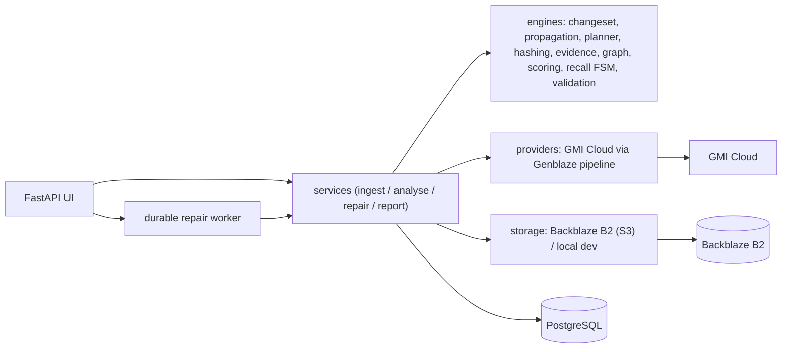

# Rusted Recall

**Change-impact intelligence for generative media.**

> Change one source. Find every affected generative asset. Repair only what must change.

| | |
|---|---|
| **Live ** | _pending deployment — owner must authorise a public HTTPS host + managed PostgreSQL (https://rusted-recall.onrender.com|
| **Judge Demo** | `<LIVE_URL>/run-live` — opens a production-backed recall with no account, setup or terminal |
| **Demo Video** | _pending recording (owner)_ |

When a product package, logo, marketing claim, price, licensed face, or
licensed voice changes, Rusted Recall identifies every affected media asset,
explains *why* it is affected, computes the **smallest** repair plan, repairs
the affected assets through a real generative-media pipeline, preserves the
previous versions immutably, and produces a complete auditable recall report.

Built for the Backblaze Generative Media Hackathon on **Backblaze B2**
(system-of-record object storage), **Genblaze** (pipeline orchestration), and a
real image **provider** (GMI Cloud).

---

## The problem

Brands ship the same claim, logo, or licensed likeness across hundreds of
derived assets. When the source of truth changes, finding and fixing every
downstream asset is manual, error-prone, and unauditable — and naively
regenerating everything is slow and expensive. Rusted Recall turns that into a
tracked, explainable, reversible, minimal-cost workflow.

## The innovation

- **ChangeSet** — determines *what actually changed* between two approved
  source versions (claim, artwork, logo, price, person, voice) with the method
  behind each result, not fixed demo strings.
- **Change propagation** — traverses real dependency edges (explicit, derived,
  inferred), cycle-safe and depth-limited, to find every affected asset — not
  mere visual similarity.
- **Causal explanations** — every classification exposes its path and evidence;
  safe assets explain why the change did *not* propagate.
- **Minimal repair** — a real repair DAG: repair masters once, deterministically
  rebuild children, and report the generative operations avoided.

## Workflow

```text
CHANGE → PROPAGATE → IMPACT → OPTIMISE → APPROVE → EXECUTE → VERIFY → COMPLETE
```

1. **Ingest** → SHA-256 + perceptual hash, OCR/declared text, immutable original
   in B2 with hash metadata and read-back verification.
2. **Connect** assets to source-of-truth items via a multimodal evidence engine;
   every edge stores full evidence, not just a score.
3. **Recall** — declare a source change (old → new version); the ChangeSet is
   computed automatically.
4. **Classify impact** with an explainable weighted score and thresholds
   (`directly_affected` / `probably_affected` / `needs_review` / `safe`).
5. **Optimise** — the MinimalRepairPlanner emits a repair DAG and the count of
   generative operations avoided.
6. **Review** decisions persist in a queue.
7. **Repair** through Genblaze → provider → validation → B2 → manifest as a
   durable background job (plan stored *before* execution).
8. **Verify & report** — new immutable version + manifest (original never
   overwritten), JSON/CSV/HTML/PDF report, append-only audit timeline.

## Two recalls to inspect

- **Golden Production Recall** — LumaLeaf: `24-Hour Vitality → Daily Botanical Blend`.
- **Generalisation Test Recall** — Northstar Coffee: an unrelated campaign with a
  different dependency topology, seeded through the same production services,
  proving the engine is not hard-coded to the demo (`/generalisation`).

Both use the exact same `ChangePropagationEngine` and `MinimalRepairPlanner`.

## Screens

Home · Command Center · Source-of-Truth Registry · Asset Registry · Create
Recall · Interactive Impact Map · Review Queue · Repair Operations (live job
state) · Before/After Gallery · Technical Evidence · Submission Evidence ·
Audit Report · Diagnostics.

## Backblaze B2

Uses the **S3-compatible API** via boto3. Source versions, originals, generated
assets, repaired versions, manifests and reports are all persisted; originals
are never overwritten and every repair creates a new immutable, read-back-verified
version. Object keys/sizes/hashes are inspectable under **Technical Evidence**
and `/diagnostics`. Docs:
<https://www.backblaze.com/docs/cloud-storage-s3-compatible-api>.

## Genblaze

Repairs run through the Genblaze pipeline (`rusted_recall/providers/genblaze.py`)
which orchestrates load → prepare → provider execution → evaluate → bounded
retry → validate → store → provenance. The provider/model/pipeline/attempts and
manifest are exposed after a run in `/diagnostics` and Technical Evidence.
Reference: <https://github.com/backblaze-labs/genblaze> and
<https://github.com/backblaze-labs/genblaze-gmicloud-pipeline>.

## Architecture



See [`docs/ARCHITECTURE.md`](docs/ARCHITECTURE.md), [`docs/DATA_MODEL.md`](docs/DATA_MODEL.md)
and [`docs/INNOVATION.md`](docs/INNOVATION.md).

## Tests

```bash
ruff check rusted_recall tests
mypy rusted_recall
pytest                    # unit + integration + E2E (mocks only in tests)
RUN_INTEGRATION=1 pytest tests/test_integration_smoke.py   # real B2/GMI smoke
```

Covered: changeset semantics, propagation traversal/cycles, minimal-repair
planning, generalisation on the Northstar campaign, tenant isolation, auth,
hashing, scoring boundaries, evidence, recall transitions, idempotency, object
keys, manifests, validation, storage read-back, the full recall E2E journey, and
the web screens. CI additionally runs **gitleaks** secret scanning.


## Limitations & honesty

- Repairs regenerate imagery via a provider; outputs are labelled truthfully
  (**Controlled Edit** / **Controlled Regeneration** / **Deterministic Rebuild**)
  and are a **new version**, never a pixel-preserving overwrite.
- Without a configured provider, repair is **disabled** with a clear message —
  never fake output.
- OCR text evidence requires Tesseract; without it declared on-image text is
  used and OCR is reported unavailable in `/diagnostics`.

---

# Self Hosting

The public SaaS above requires no infrastructure from users. Everything below is
for **operators self-hosting** Rusted Recall.

## Quick start (no external services)

```bash
python -m venv .venv && . .venv/bin/activate
pip install -r requirements-dev.txt && pip install -e .

export APP_ENV=development STORAGE_BACKEND=local \
       DATABASE_URL="sqlite:///./rusted_recall.db"

python -m rusted_recall.demo.seed              # seed both demo campaigns
uvicorn rusted_recall.web.app:app --reload     # http://localhost:8000
```

Ingestion, dependency analysis, impact scoring, review, and reports work with
zero credentials. Repairs require a real provider.

## Production (Docker Compose + PostgreSQL + B2 + provider)

```bash
cp .env.example .env    # fill in real B2 + GMI Cloud values
docker compose up --build
```

Provide `B2_KEY_ID`, `B2_APP_KEY`, `B2_BUCKET_NAME`, `B2_S3_ENDPOINT`,
`B2_REGION`, `GMICLOUD_API_KEY` and `GENBLAZE_ENABLED=true`. See
[`release/`](release/) for install, environment, Backblaze, Genblaze, security
and production guides. Secrets stay server-side; there are no credential-entry
screens for customers.

## License

MIT.
