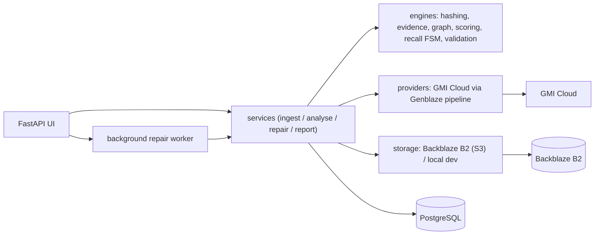

# Rusted Recall

**Change-impact intelligence and automated recall for generative media.**

When a product package, logo, marketing claim, price, licensed face, or
licensed voice changes, Rusted Recall identifies every affected media asset,
explains *why* it is affected, repairs affected assets through a real
generative-media pipeline, preserves the previous versions immutably, and
produces a complete auditable recall report.

Built for the Backblaze Generative Media hackathon on **Backblaze B2**
(persistent object storage), **Genblaze** (pipeline orchestration), and **GMI
Cloud** (image generation/editing).

---

## Why

Brands ship the same claim, logo, or licensed likeness across hundreds of
derived assets. When the source of truth changes, finding and fixing every
downstream asset is manual, error-prone, and unauditable. Rusted Recall turns
that into a tracked, explainable, reversible workflow.

## What it does

1. **Ingest** an asset → compute SHA-256 + perceptual hash, extract text (OCR
   when available), store the original immutably in B2 with content-type/length/
   hash metadata and read-back verification.
2. **Connect** assets to source-of-truth items via a multimodal evidence engine
   (explicit declaration, prompt/manifest, SHA-256 duplicate, perceptual-hash
   derivative, OCR text match, semantic similarity, visual similarity,
   parent-child derivation). Every edge stores full evidence, not just a score.
3. **Recall** — declare a source change (old → new version).
4. **Classify impact** with an explainable weighted score and thresholds
   (`directly_affected` / `probably_affected` / `needs_review` / `safe`),
   persisting the component values, reasons, and the strongest dependency path.
5. **Review** in a queue that persists human decisions.
6. **Repair** through the Genblaze/GMI pipeline as a durable background job,
   storing a deterministic plan *before* execution.
7. **Validate** the output, store a **new immutable version** + manifest in B2
   (the original is never overwritten).
8. **Report** the whole recall as JSON / CSV / HTML / PDF with an append-only
   audit timeline and integrity hashes.

## Architecture



See [`docs/ARCHITECTURE.md`](docs/ARCHITECTURE.md) for the full diagrams and the
recall lifecycle, and [`docs/DATA_MODEL.md`](docs/DATA_MODEL.md) for the schema
and lineage chain.

## Screens

Command Center · Source-of-Truth Registry · Asset Registry · Create Recall ·
Interactive Impact Map · Review Queue · Repair Operations (live job state) ·
Before/After Gallery · Audit Report · Diagnostics.

## Quick start (no external services)

```bash
python -m venv .venv && . .venv/bin/activate
pip install -r requirements-dev.txt && pip install -e .

export APP_ENV=development STORAGE_BACKEND=local \
       DATABASE_URL="sqlite:///./rusted_recall.db"

python -m rusted_recall.demo.lumaleaf          # seed the demo campaign
uvicorn rusted_recall.web.app:app --reload     # http://localhost:8000
```

Ingestion, dependency analysis, impact scoring, review, and reports work with
zero credentials. **Repairs require a real provider** — without one the UI
disables repair and says so (no fake output).

## Production (Docker Compose + PostgreSQL + B2 + GMI)

```bash
cp .env.example .env    # fill in real B2 + GMI Cloud values
docker compose up --build
```

### Backblaze B2

Uses the **S3-compatible API** via boto3. Provide `B2_KEY_ID`, `B2_APP_KEY`,
`B2_BUCKET_NAME`, `B2_S3_ENDPOINT`, `B2_REGION`. Objects are written under a
deterministic namespace (see `docs/DATA_MODEL.md`) with hash metadata and
read-back verification. Docs:
<https://www.backblaze.com/docs/cloud-storage-s3-compatible-api>.

### Genblaze + GMI Cloud

Repairs run through the Genblaze pipeline (`rusted_recall/providers/genblaze.py`)
which invokes the GMI Cloud image API
(`rusted_recall/providers/gmicloud.py`). Set `GMICLOUD_API_KEY` (and
`GENBLAZE_ENABLED=true`). Reference:
<https://github.com/backblaze-labs/genblaze> and
<https://github.com/backblaze-labs/genblaze-gmicloud-pipeline>.

## Testing

```bash
pip install -r requirements-dev.txt
ruff check rusted_recall tests
pytest                    # unit + integration + E2E (mocks only in tests)
RUN_INTEGRATION=1 pytest tests/test_integration_smoke.py   # real B2/GMI smoke
```

Covered: hashing, pHash distance, scoring boundaries, graph traversal/cycles,
evidence, recall transitions, idempotency keys, object keys, manifests, error
classification, validation, storage read-back, the full recall E2E journey, and
the web screens.

## Limitations & honesty

- Repairs regenerate imagery via a provider; the result is a **new version**,
  not a pixel-preserving edit of the original, and is labelled as such.
- OCR text evidence requires Tesseract; without it the app uses declared
  on-image text and reports OCR as unavailable in `/diagnostics`.
- The background job runner is in-process (durable via DB rows). For multi-node
  scale, point it at an external queue consuming the same `repair_jobs` rows.
- The Genblaze pipeline wraps the provider with staged orchestration; wire the
  upstream Genblaze release into `GENBLAZE_ENABLED` deployments and pin it.

## Security

See [`docs/SECURITY.md`](docs/SECURITY.md). **Note:** credentials were
previously committed to git history and must be rotated — details in that doc.

## License

MIT.
