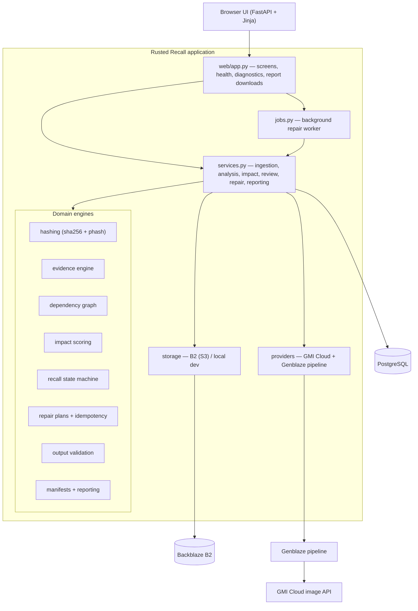
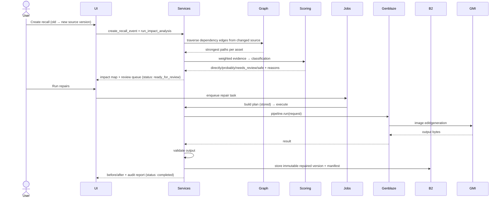

# Architecture

Rusted Recall detects when a source-of-truth element changes, finds every
affected media asset with explainable evidence, repairs affected assets through
a real generative-media pipeline, preserves prior versions immutably, and emits
an auditable recall report.

## Component diagram



## Recall lifecycle



## State machine (recall status)

`draft → analysing → ready_for_review → approved → repairing →
partially_completed | completed`, with `failed` and `cancelled` as alternate
terminals. Transitions are enforced in `rusted_recall/recall.py`; illegal
transitions raise.

## Scoring (directive section 12)

```
evidence_score = 0.30·structural + 0.20·visual + 0.15·text
               + 0.15·semantic + 0.10·derivation + 0.10·human_confirmation
impact_score   = evidence_score · market_applicability · active_distribution
```

Thresholds: `directly_affected ≥ 0.80`, `probably_affected ≥ 0.55`,
`needs_review ≥ 0.25`, else `safe`. A confirmed explicit dependency overrides to
`directly_affected`; conflicting evidence forces `needs_review`. Weights and
thresholds live in `config.py` and are shown on `/diagnostics`.

## Why FastAPI (not Streamlit)

The required screens need an interactive impact-map graph, real background job
state with polling, streamed object serving, and multi-format report downloads.
A FastAPI app with server-rendered templates delivers these reliably in one
coherent product, replacing the original Streamlit prototype and its off-scope
modes.

## Trust boundaries

- **No provider → no output.** Repairs are disabled and reported; nothing is
  fabricated.
- **No B2 in production → hard failure.** Local storage is dev-only.
- Test-only deterministic providers live under `tests/` and are never imported
  by the application.
