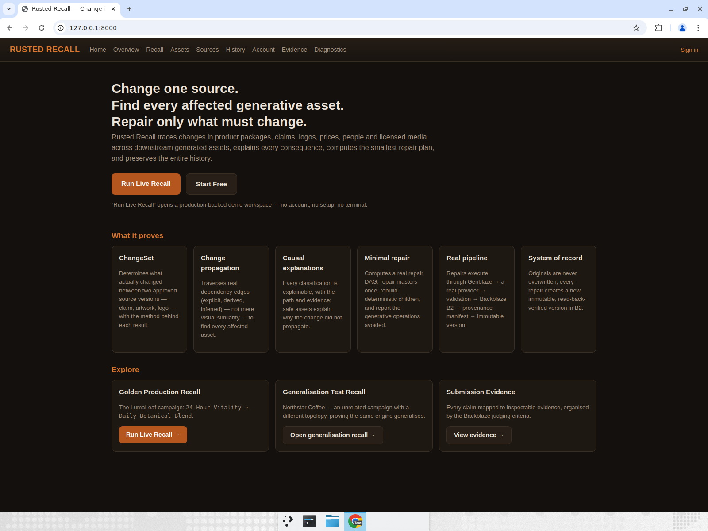
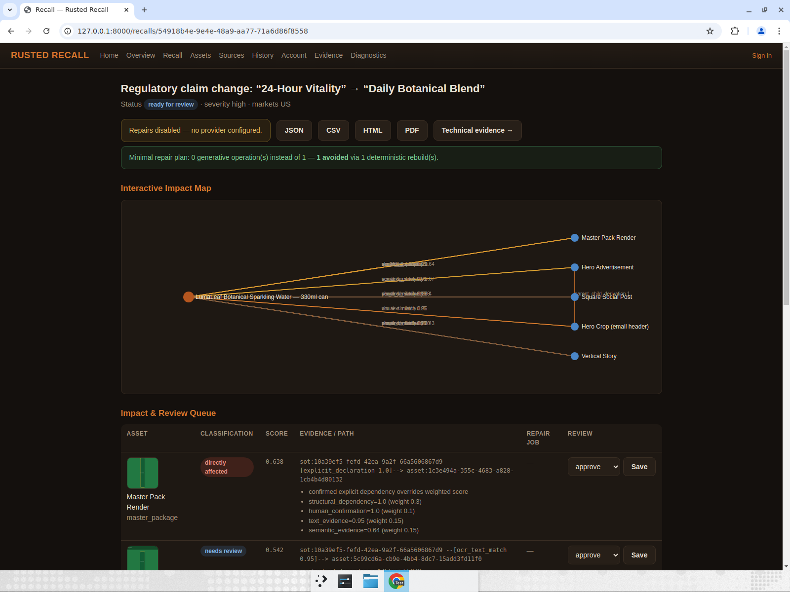
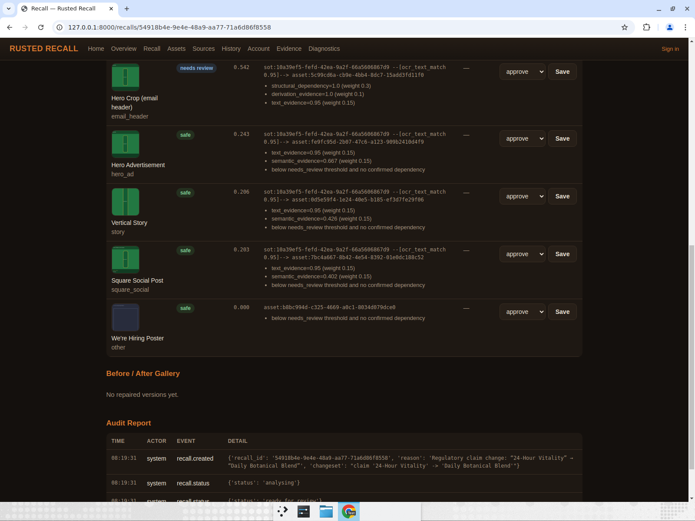
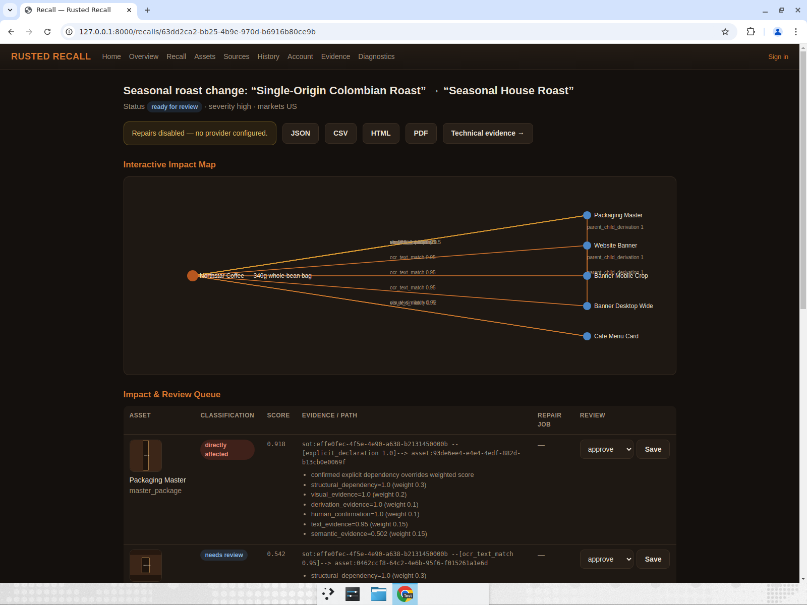
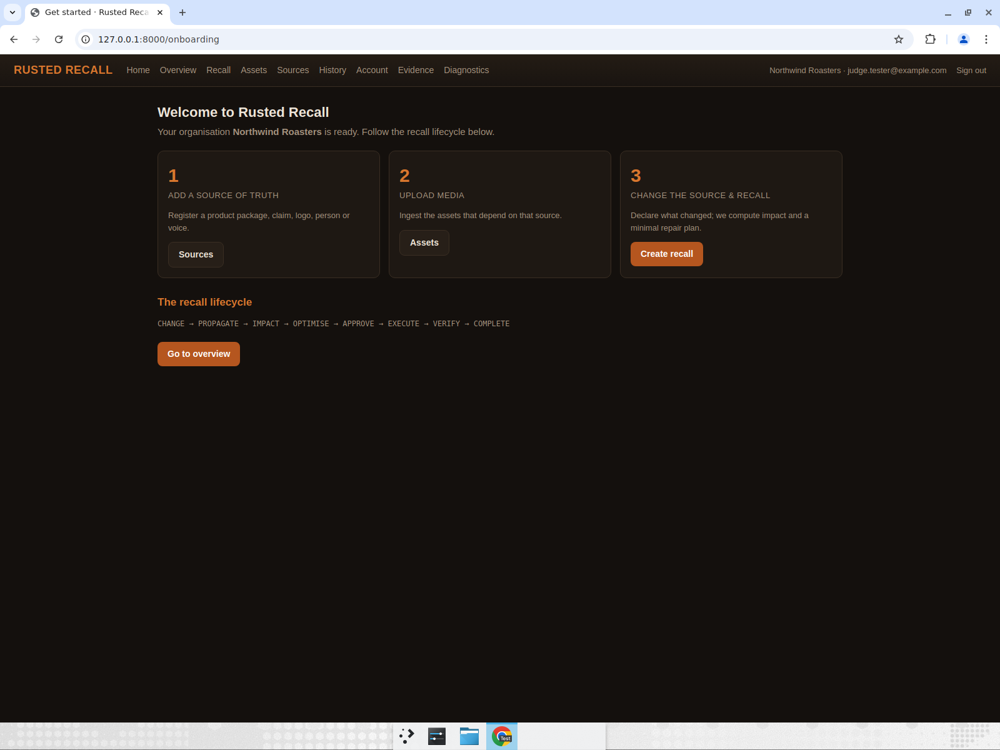
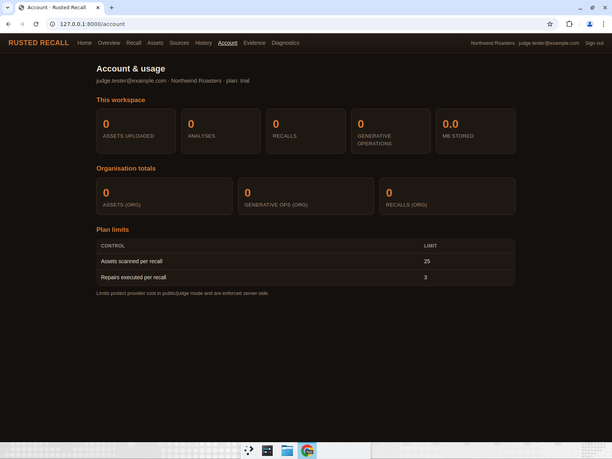
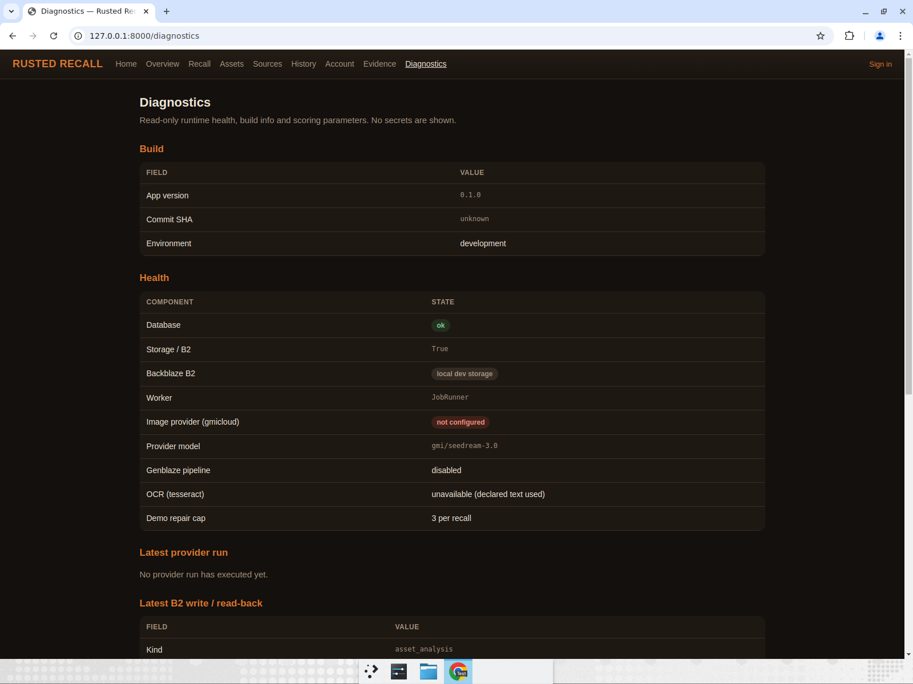
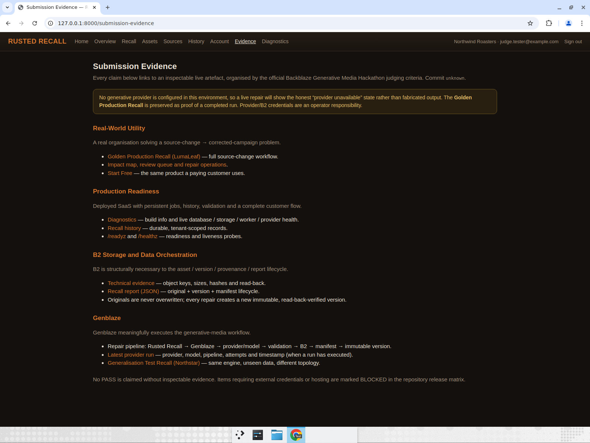

# Rusted Recall — E2E Test Report

**How tested:** Ran the app locally (`uvicorn`, `APP_ENV=development STORAGE_BACKEND=local`, demo seeded via `python -m rusted_recall.demo.seed`) and exercised the judge, customer, and evidence flows through the browser UI. No generative provider was configured — this is the expected state, so repairs must show the honest "provider unavailable" state (verified below).

**Scope:** PR #3 (merged into `main`): product homepage, judge Run-Live entry, Northstar generalisation recall, submission-evidence, enriched diagnostics.

## Result summary

All primary assertions passed. No failures. Nothing was fabricated — the repair path correctly shows the disabled state because no provider credentials are configured.

- PASS — Homepage is a product page with the directive headline + "Run Live Recall" and "Start Free" CTAs.
- PASS — "Run Live Recall" enters the LumaLeaf recall with **no login**, showing claim `24-Hour Vitality → Daily Botanical Blend`.
- PASS — Impact is classified with explainable evidence (Master Pack Render `directly_affected` 0.638 via `explicit_declaration`); disconnected "We're Hiring Poster" is `safe` 0.000; repairs show "Repairs disabled — no provider configured".
- PASS — Minimal Repair plan is calculated, not constant: `0 generative operation(s) instead of 1 — 1 avoided via 1 deterministic rebuild`.
- PASS — Generalisation: Northstar recall shows a **different topology and scores** (Packaging Master 0.918 with `visual_evidence=1.0`, a `replace_visual_reference` changeset, and a distinct plan: 1 generative op / 0 avoided vs LumaLeaf's 0/1); disconnected "Office Wi-Fi Notice" is `safe` 0.000.
- PASS — Customer signup authenticates into an isolated org ("Northwind Roasters"), onboarding + account/usage render, plan limits (25 assets, 3 repairs) shown enforced server-side.
- PASS — Diagnostics honestly shows provider `not configured`, Genblaze `disabled`, B2 `local dev storage`, worker, commit SHA, evidence weights/thresholds — no secrets.
- PASS — Submission-evidence page has all four Backblaze judging criteria, each linking to inspectable live artefacts, with the honest provider-unavailable banner.

## Caveats / not tested (owner-blocked)
- **Real generative repair, real B2 writes, and a real Genblaze provider run were NOT tested** because no provider/B2 credentials are configured. The app correctly shows the disabled/honest state instead of fabricating output — this is the intended behavior, but it means the live-provider path itself remains unproven until credentials are supplied.
- Public HTTPS deployment / managed Postgres not tested (owner-blocked); tested against local SQLite + local storage.

## Evidence

### Homepage (product page + CTAs)

### Judge Run-Live → LumaLeaf recall (no login), evidence + honest disabled repair

### Minimal repair plan (calculated) and disconnected asset safe

### Generalisation — Northstar recall (different topology/scores)

### Customer signup → own workspace (onboarding)

### Account & usage (scoped to new org, plan limits)

### Diagnostics (honest health, no secrets)

### Submission evidence (four judging criteria)

